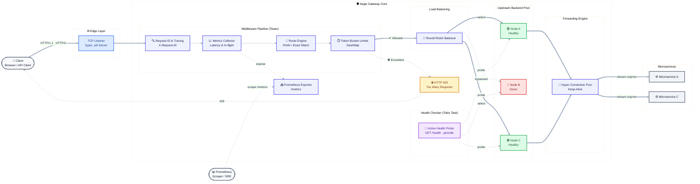

```mermaid
---
config:
  theme: base
  themeVariables:
    primaryColor: "#eef2ff"
    primaryTextColor: "#1e1b4b"
    primaryBorderColor: "#4f46e5"
    lineColor: "#94a3b8"
    fontSize: "14px"
  flowchart:
    curve: basis
    nodeSpacing: 45
    rankSpacing: 60
    padding: 15
---
flowchart LR
    %% ===== External Actors =====
    Client(["👤 Client<br/>Browser / API Client"])
    Prom(["📊 Prometheus<br/>Scraper / SRE"])

    %% ===== Edge Layer =====
    subgraph EDGE["🌐 Edge Layer"]
        Listener["TCP Listener<br/><i>hyper_util Server</i>"]
    end

    %% ===== Gateway Core =====
    subgraph GW["🛡️ Aegis Gateway Core"]
        direction TB

        subgraph MW["Middleware Pipeline (Tower)"]
            direction TB
            Tracing["🔍 Request ID &amp; Tracing<br/><i>X-Request-ID</i>"]
            Metrics["📈 Metrics Collector<br/><i>Latency &amp; In-flight</i>"]
            Router["🧭 Route Engine<br/><i>Prefix / Exact Match</i>"]
            RateLimiter["⏱️ Token Bucket Limiter<br/><i>DashMap</i>"]
            Tracing --> Metrics --> Router --> RateLimiter
        end

        Reject["⛔ HTTP 429<br/>Too Many Requests"]

        subgraph LB["Load Balancing"]
            Balancer["🔁 Round-Robin Balancer"]
        end

        subgraph POOL["Upstream Backend Pool"]
            direction LR
            NodeA["🟢 Node A<br/><i>Healthy</i>"]
            NodeB["🔴 Node B<br/><i>Down</i>"]
            NodeC["🟢 Node C<br/><i>Healthy</i>"]
        end

        subgraph HC["Health Checker (Tokio Task)"]
            Prober["💓 Active Health Probe<br/><i>GET /health · periodic</i>"]
        end

        subgraph FWD["Forwarding Engine"]
            Pool["🔌 Hyper Connection Pool<br/><i>Keep-Alive</i>"]
        end

        MetricsEndpoint["📤 Prometheus Exporter<br/><i>/metrics</i>"]
    end

    %% ===== Backends =====
    subgraph SVC["Microservices"]
        direction TB
        SvcA["⚙️ Microservice A"]
        SvcC["⚙️ Microservice C"]
    end

    %% ===== Primary Request Path =====
    Client ==>|"HTTP/1.1 · HTTP/2"| Listener
    Listener ==> Tracing
    RateLimiter ==>|"✔ Allowed"| Balancer
    RateLimiter -.->|"✖ Exceeded"| Reject
    Reject -.->|"429"| Client

    Balancer ==>|"select"| NodeA
    Balancer ==>|"select"| NodeC
    Balancer -.->|"bypassed"| NodeB

    NodeA ==> Pool
    NodeC ==> Pool

    Pool ==>|"stream req/res"| SvcA
    Pool ==>|"stream req/res"| SvcC

    %% ===== Health Checks =====
    Prober -.->|"probe"| NodeA
    Prober -.->|"probe"| NodeB
    Prober -.->|"probe"| NodeC

    %% ===== Observability =====
    Metrics -.->|"expose"| MetricsEndpoint
    Prom -.->|"scrape /metrics"| MetricsEndpoint

    %% ===== Styling =====
    classDef external fill:#f8fafc,stroke:#475569,stroke-width:2px,color:#0f172a
    classDef edge fill:#dbeafe,stroke:#2563eb,stroke-width:2px,color:#1e3a8a
    classDef gateway fill:#eef2ff,stroke:#4f46e5,stroke-width:2px,color:#1e1b4b
    classDef healthy fill:#dcfce7,stroke:#16a34a,stroke-width:2px,color:#14532d
    classDef unhealthy fill:#fee2e2,stroke:#dc2626,stroke-width:2px,color:#7f1d1d
    classDef reject fill:#fef3c7,stroke:#d97706,stroke-width:2px,color:#78350f
    classDef svc fill:#f1f5f9,stroke:#334155,stroke-width:2px,color:#0f172a
    classDef obs fill:#f3e8ff,stroke:#9333ea,stroke-width:2px,color:#4c1d95

    class Client,Prom external
    class Listener edge
    class Tracing,Metrics,Router,RateLimiter,Balancer,Pool,MetricsEndpoint gateway
    class NodeA,NodeC healthy
    class NodeB unhealthy
    class Reject reject
    class SvcA,SvcC svc
    class Prober obs
```