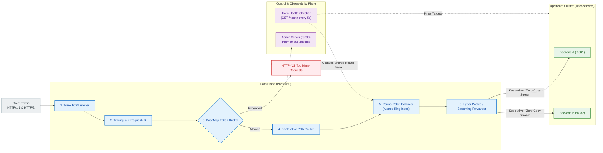

```mermaid
    flowchart LR
        %% Styles
        classDef client fill:#eceff1,stroke:#607d8b,stroke-width:1.5px,color:#263238;
        classDef dataplane fill:#e3f2fd,stroke:#1976d2,stroke-width:2px,color:#0d47a1;
        classDef control fill:#f3e5f5,stroke:#7b1fa2,stroke-width:1.5px,color:#4a148c;
        classDef reject fill:#ffebee,stroke:#d32f2f,stroke-width:1.5px,color:#b71c1c;
        classDef backend fill:#e8f5e9,stroke:#388e3c,stroke-width:1.5px,color:#1b5e20;

        %% Ingress
        Client["Client Traffic<br/>HTTP/1.1 & HTTP/2"]:::client

        %% Core Data Plane
        subgraph DataPlane ["Data Plane (Port 8080)"]
            direction TB
            Listener["1. Tokio TCP Listener"]:::dataplane
            Tracing["2. Tracing & X-Request-ID"]:::dataplane
            RateLimiter{"3. DashMap Token Bucket"}:::dataplane
            Router["4. Declarative Path Router"]:::dataplane
            Balancer["5. Round-Robin Balancer<br/>(Atomic Ring Index)"]:::dataplane
            Forwarder["6. Hyper Pooled / Streaming Forwarder"]:::dataplane

            Listener --> Tracing
            Tracing --> RateLimiter
            RateLimiter -->|"Allowed"| Router
            Router --> Balancer
            Balancer --> Forwarder
        end

        %% Rejection Path
        Drop["HTTP 429 Too Many Requests"]:::reject
        RateLimiter -->|"Exceeded"| Drop

        %% Upstreams
        subgraph UpstreamCluster ["Upstream Cluster ('user-service')"]
            direction TB
            NodeA["Backend A (:8081)"]:::backend
            NodeB["Backend B (:8082)"]:::backend
        end

        %% Control & Observability Plane
        subgraph ControlPlane ["Control & Observability Plane"]
            direction TB
            HC["Tokio Health Checker<br/>(GET /health every 5s)"]:::control
            Prometheus["Admin Server (:9090)<br/>Prometheus /metrics"]:::control
        end

        %% Connections
        Client --> Listener
        Forwarder -->|"Keep-Alive / Zero-Copy Stream"| NodeA
        Forwarder -->|"Keep-Alive / Zero-Copy Stream"| NodeB

        %% Cross-cutting relationships
        HC -.->|"Pings Targets"| UpstreamCluster
        HC -.->|"Updates Shared Health State"| Balancer
        DataPlane -.->|"Latency & Status Counters"| Prometheus
```