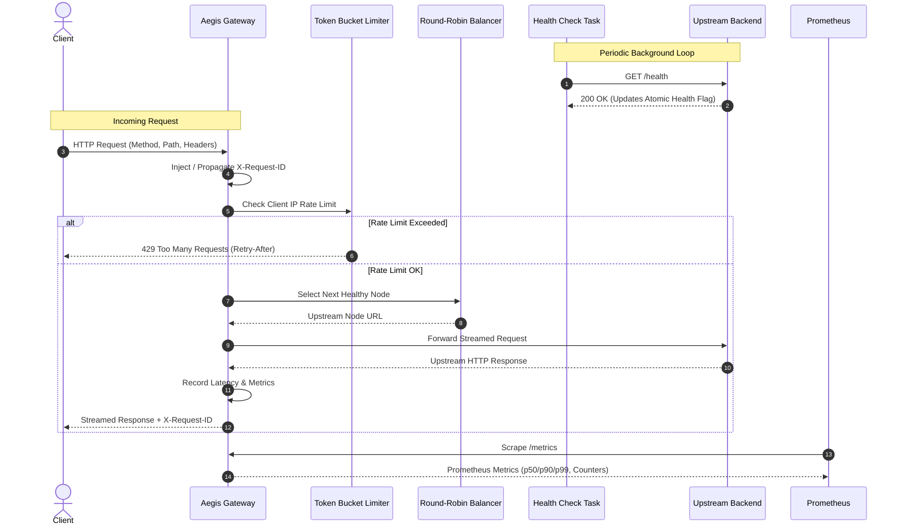

```mermaid
    sequenceDiagram
        autonumber
        actor Client
        participant GW as Aegis Gateway
        participant RL as Token Bucket Limiter
        participant LB as Round-Robin Balancer
        participant HC as Health Check Task
        participant BE as Upstream Backend
        participant Prom as Prometheus

        Note over HC,BE: Periodic Background Loop
        HC->>BE: GET /health
        BE-->>HC: 200 OK (Updates Atomic Health Flag)

        Note over Client,GW: Incoming Request
        Client->>GW: HTTP Request (Method, Path, Headers)
        GW->>GW: Inject / Propagate X-Request-ID
        GW->>RL: Check Client IP Rate Limit
        alt Rate Limit Exceeded
            RL-->>Client: 429 Too Many Requests (Retry-After)
        else Rate Limit OK
            GW->>LB: Select Next Healthy Node
            LB-->>GW: Upstream Node URL
            GW->>BE: Forward Streamed Request
            BE-->>GW: Upstream HTTP Response
            GW->>GW: Record Latency & Metrics
            GW-->>Client: Streamed Response + X-Request-ID
        end

        Prom->>GW: Scrape /metrics
        GW-->>Prom: Prometheus Metrics (p50/p90/p99, Counters)
```