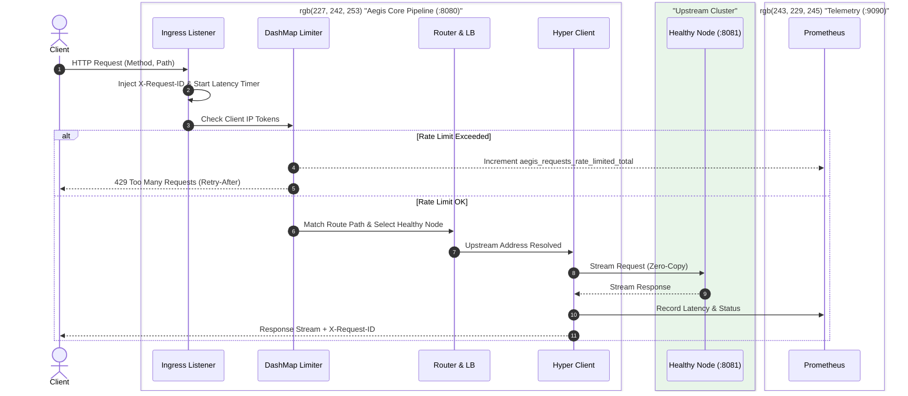

```mermaid
    sequenceDiagram
        autonumber
        actor Client
        box rgb(227, 242, 253) "Aegis Core Pipeline (:8080)"
            participant Ingress as Ingress Listener
            participant Limiter as DashMap Limiter
            participant Router as Router & LB
            participant Forwarder as Hyper Client
        end
        box rgb(232, 245, 233) "Upstream Cluster"
            participant Backend as Healthy Node (:8081)
        end
        box rgb(243, 229, 245) "Telemetry (:9090)"
            participant Metrics as Prometheus
        end

        Client->>Ingress: HTTP Request (Method, Path)
        Ingress->>Ingress: Inject X-Request-ID & Start Latency Timer

        Ingress->>Limiter: Check Client IP Tokens
        alt Rate Limit Exceeded
            Limiter-->>Metrics: Increment aegis_requests_rate_limited_total
            Limiter-->>Client: 429 Too Many Requests (Retry-After)
        else Rate Limit OK
            Limiter->>Router: Match Route Path & Select Healthy Node
            Router->>Forwarder: Upstream Address Resolved

            Forwarder->>Backend: Stream Request (Zero-Copy)
            Backend-->>Forwarder: Stream Response

            Forwarder->>Metrics: Record Latency & Status
            Forwarder-->>Client: Response Stream + X-Request-ID
        end
```